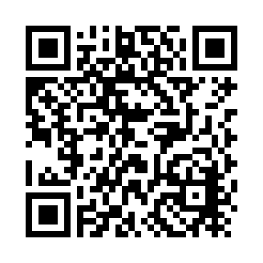

# Continuous Reporting Community Working Group
Welcome to the Continuous Reporting Community Working Group! Please refer to the [Working Group Plan](./plan.md) for information about the goals and primary audience of the working group.

The community mediator will host a biweekly 30 minute town hall on Thursdays at 1:00 PM ET on Zoom for managed discussion, updates, and Q&A, starting on on Thursday, April 24th.

[REGISTER HERE](https://gsa.zoomgov.com/meeting/register/j-jCL-LLTi2uWTRMdrWBzw)

## Meeting Recordings

To quickly access the most recent meeting recordings, open this group's playlist on YouTube [with this link](https://www.youtube.com/playlist?list=PL1orhY9kSkzQghZZQB4W5SoZKmhyZ0j_k) or use the QR code below.

Recordings for the town hall meetings can be found below. The links to the recordings may be posted a business day or two after the meeting occurred. 

| Meeting Date | Meeting Slides     | Meeting Recording | Duration (hh:mm:ss) |
|--------------|--------------------|-------------------|------------------|
| 4/10/2025    | [Slides (PDF)](./assets/cr_cwg_20250410.pdf) | [Youtube Video](https://www.youtube.com/watch?v=juTMrGv4KR8) | 00:10:19 |
| 4/24/2025    | [Slides (PDF)](./assets/cr_cwg_20250424.pdf) | [Youtube Video](https://www.youtube.com/watch?v=gC5kdU0FY5k) | 00:10:50 |
| 5/8/2025     | [Slides (PDF)](./assets/cr_cwg_20250508.pdf) | [Youtube Video](https://www.youtube.com/watch?v=qIKmSwJArhg) | 00:08:08 |
| 5/22/2025    | [Slides (PDF)](./assets/cr_cwg_20250522.pdf) | [Youtube Video](https://www.youtube.com/watch?v=cwykb2qVGP8) | 00:10:19 |
